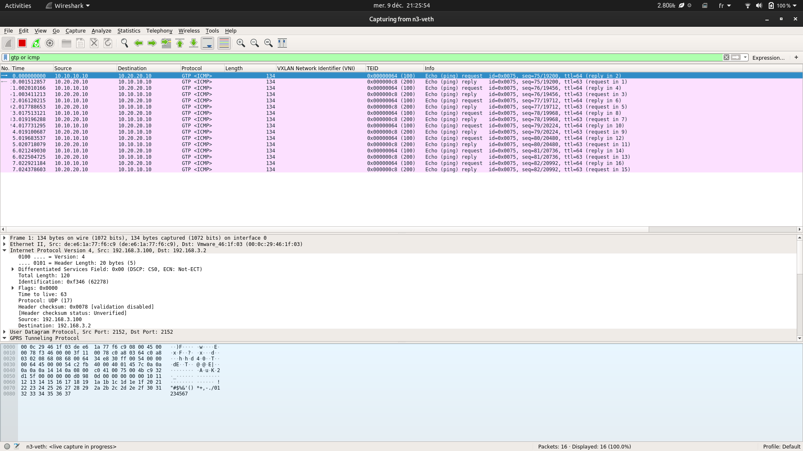

# GTPGW/UPF-VPP Helper Sripts

A set of scripts to configure:

- The GTP GW (or RAN emulator)
- The UPF (User Plane Function)

## Tree

```console
tree 
.
├── 0001-vtep-gtpgw-setup.sh
├── 0001-vtep-upf-setup.sh
├── 0002-gtpgw-setup.sh
├── 0002-llb-endpoint-setup.sh
├── 0002-upf-ue-route-setup.sh
├── 0002-vpp-veths-setup.sh
├── 0100-ue-endpoint-setup.sh
├── config
│   ├── 0003-init.conf
│   ├── 0003-session.yaml
│   ├── 0003-startup_debug.conf
│   └── 0100-netplan-bridge-config.yaml
├── dummy
│   ├── 0050-dummy-gtpgw-setup.sh
│   └── 0050-dummy-upf-setup.sh
├── env-config.sh
├── kernel
│   ├── 0100-dpdk-install.sh
│   └── README.md
├── README.md
└── static
    ├── mec-integration.drawio
    ├── mec-integration-overview.png
    ├── mec-integration.png
    └── wireshark.png

4 directories, 21 files
```

## Test

A ping test shows that the LADN IP is reachable from the GTPGW side where we have the UE IP address configured on the loopback.


